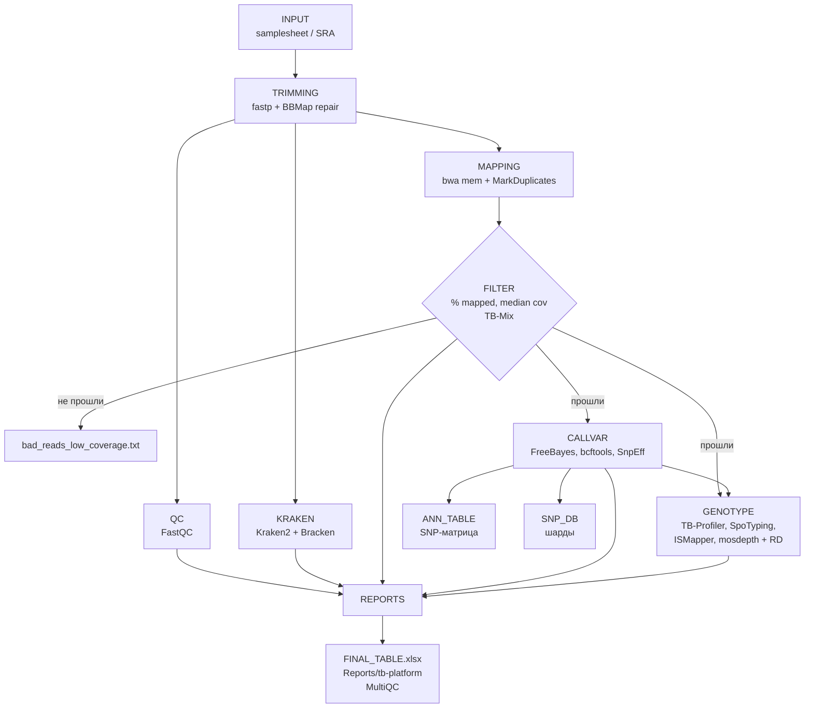

# TB-Lite: техническая документация

Как пайплайн устроен внутри: из каких блоков состоит, что делает каждый
этап, какие программы и с какими параметрами запускаются, как собираются
отчёты и таблицы для TB Platform. Как запускать — в [README.md](README.md).

## Содержание

1. [Общая схема](#1-общая-схема)
2. [Этапы подробно](#2-этапы-подробно)
3. [Отчёты](#3-отчёты)
4. [SNP-таблицы для TB Platform](#4-snp-таблицы-для-tb-platform)
5. [Batch-режим изнутри](#5-batch-режим-изнутри)
6. [Отдельные точки входа](#6-отдельные-точки-входа)
7. [Загрузка в TB Platform](#7-загрузка-в-tb-platform)
8. [Инструменты и контейнеры](#8-инструменты-и-контейнеры)
9. [Параметры](#9-параметры)
10. [Ресурсы и профили](#10-ресурсы-и-профили)
11. [Выходные каталоги](#11-выходные-каталоги)
12. [Структура репозитория](#12-структура-репозитория)
13. [Известные ограничения](#13-известные-ограничения)

---

## 1. Общая схема

### Основные блоки

Пайплайн (`main.nf` → `workflows/tblite.nf`) состоит из восьми блоков.
Образец проходит их по порядку, но после блока FILTER дальше идут только
образцы с достаточным качеством.

| # | Блок | Что делает простыми словами |
|---|---|---|
| 1 | **INPUT** | Читает samplesheet или скачивает риды из SRA |
| 2 | **TRIMMING** | Проверяет FASTQ, обрезает адаптеры и плохие хвосты, чинит пары |
| 3 | **QC** | Строит отчёты о качестве ридов (FastQC) |
| 4 | **MAPPING** | Выравнивает риды на H37Rv, помечает дубликаты |
| 5 | **FILTER** | Считает покрытие и % картирования, отсеивает слабые образцы; ищет смеси штаммов (TB-Mix) |
| 6 | **CALLVAR** | Находит варианты (SNP, инделы) и аннотирует их |
| 7 | **GENOTYPE** | Определяет линию, сполиготип, RD-делеции, вставки IS6110, лекарственную устойчивость |
| 8 | **REPORTS** | Собирает всё в итоговые таблицы, MultiQC и данные для TB Platform |

Сбоку от основной цепочки работают три ветки:

- **KRAKEN** — таксономия ридов (опционально, запускается до фильтра).
- **ANN_TABLE** — когортная SNP-матрица по всем образцам.
- **SNP_DB** — заготовки SNP-таблиц для базы TB Platform.

### Поток данных



### Ключевые правила

- **Фильтр качества** — образец идёт дальше, если `% mapped ≥ 90` и
  `median coverage ≥ 30` (`--min_align_pct`, `--min_median`).
- **Отбракованные образцы не теряются**: они остаются в `FINAL_TABLE.xlsx`
  (с пустыми полями после фильтра) и в `bad_reads_*.txt`, но не попадают
  в таблицы TB Platform.
- **Битые входные данные не роняют прогон**: пустой или повреждённый FASTQ,
  а также SRA с неподдерживаемым layout пропускаются с записью в отчёт.
- **Референс** — H37Rv (`NC_000962.3`), `assets/h37rv.fa` + `assets/h37rv.gbk`.

---

## 2. Этапы подробно

### 2.1 INPUT

**FASTQ** (`subworkflows/local/input_check.nf`). Читает CSV. Колонки
принимаются в обоих вариантах: `sample|Sample|id|ID`, `fastq_1|R1`,
`fastq_2|R2`, `layout|Layout`. Проверяет, что файлы существуют и имеют
расширение `.fastq.gz`/`.fq.gz`. Если указан `Layout=PAIRED`, файлов должно
быть ровно два. Для каждого образца определяется `single_end`.

**SRA** (`subworkflows/local/sra_input.nf`):

1. `CUSTOM_SRATOOLSNCBISETTINGS` — конфиг sra-tools.
2. `SRATOOLS_PREFETCH` — скачивание `.sra` (до 2 повторов, после этого
   accession пропускается — `errorStrategy ignore`). `.sra` остаются только в `work/` и в `outdir` не копируются.
3. `SRA_DETECT_LAYOUT` — пробный `fasterq-dump`: 1 FASTQ → single,
   2 → paired, иначе accession пропускается и попадает в
   `unsupported_sra_layout.txt`.
4. `SRATOOLS_FASTERQDUMP` (`--split-files --skip-technical`) — итоговые FASTQ.

### 2.2 TRIMMING

`subworkflows/local/trimming.nf`

| Шаг | Программа | Параметры / логика |
|---|---|---|
| `VALIDATE_RAW_FASTQ` | gzip | Файл не пустой, `gzip -t` проходит, внутри есть данные |
| `FASTP` | fastp 1.1.0 | `--trim_poly_g` + автоопределение адаптеров |
| `VALIDATE_TRIMMED_FASTQ` | gzip | Та же проверка после fastp |
| `BBMAP_REPAIR` | BBMap repair.sh | Только paired: восстанавливает согласованность пар после тримминга |
| `VALIDATE_FINAL_FASTQ` | gzip | Проверка итоговых ридов |

Образец, не прошедший любую из проверок, пропускается с причиной
(`raw_invalid_fastq`, `trimmed_invalid_fastq`, `final_invalid_fastq`)
и записью в `bad_reads_invalid_fastq.txt`.

### 2.3 QC

`FASTQC` (0.12.1) по итоговым (обрезанным) ридам. Отключается `--skip_qc`.

### 2.4 MAPPING

| Шаг | Программа | Параметры |
|---|---|---|
| `BWA_INDEX` | bwa | Индекс референса (один раз на прогон) |
| `SAMTOOLS_FAIDX` | samtools 1.23.1 | `.fai` референса |
| `BWA_MEM` | bwa mem + samtools sort | `-M`, read group `ID=SM=LB=<sample>`, `PL=ILLUMINA` |
| `PICARD_MARKDUPLICATES` | Picard 3.4.0 | `--ASSUME_SORTED true --CREATE_INDEX true`; дубликаты помечаются, но не удаляются |

BAM в `outdir` не публикуется, он остаётся только в `work/`.

### 2.5 FILTER

`subworkflows/local/filter.nf`. Метрики считаются по **всем** образцам.

| Шаг | Программа | Параметры |
|---|---|---|
| `PICARD_COLLECTWGSMETRICS` | Picard | `--COVERAGE_CAP 100000 --COUNT_UNPAIRED true` → mean и median coverage |
| `PICARD_COLLECTALIGNMENTSUMMARYMETRICS` | Picard | для MultiQC |
| `SAMTOOLS_STATS` | samtools | для MultiQC |
| `SAMTOOLS_FLAGSTAT` | samtools | → `% mapped` |
| `TB_MIX` | `bin/tb_mix.py` (pysam) | `--mq 30 --bq 20 -f 0.04 --mix-low 0.05 --mix-high 0.95` |

**Решение о фильтре** принимается в Groovy прямо в workflow:

- `% mapped` берётся из строки `mapped (NN.NN%)` в flagstat;
- `mean`/`median coverage` берутся из колонок 2 и 4 CollectWgsMetrics;
- прошёл: `pct ≥ min_align_pct` **и** `median ≥ min_median`;
- не прошёл → строка в `bad_reads_low_coverage.txt`
  (`sample_id, reads_mapped_pct, mean_coverage, median_coverage`).

**TB-Mix** определяет смесь линий по частотам линие-специфичных SNP
из `assets/tbmix/levels.tsv`. Уровни линий проверяются от 5 к 1.
Образец считается смешанным (`mix`), если на уровне есть больше одной
линии с AF ≥ 0.05, либо у единственной линии есть SNP с AF в интервале
[0.05; 0.95], либо присутствует любая линия `Bmyc*`. Иначе — `clear`.
TB-Mix запускается до фильтра, поэтому его результат есть и у отбракованных.

### 2.6 KRAKEN (опционально)

`subworkflows/local/kraken.nf`. Запускается, если задан `--kraken2_db`
и не задан `--skip_kraken`. Работает на итоговых ридах после тримминга,
**до** фильтра качества, поэтому считается и для отбракованных образцов.

| Шаг | Программа | Параметры |
|---|---|---|
| `KRAKEN2_DB1/2` | Kraken2 | `--confidence 0.05 --use-names` |
| `BRACKEN_DB1/2` | Bracken 3.1 | `-r 50 -l S -t 1` (уровень вида) |
| `ADD_DB1/2` | `bin/add_unclassified.sh` | Добавляет в Bracken-таблицу долю unclassified из отчёта Kraken |
| `COMBINE_DB1/2` | combine_bracken_outputs | Общая таблица всех образцов на базу |

Результаты раскладываются по меткам баз (`db_label`), вторая база
обрабатывается независимо.

### 2.7 CALLVAR

`subworkflows/local/call_variants.nf`. Только образцы, прошедшие фильтр.

| Шаг | Программа | Параметры |
|---|---|---|
| `FREEBAYES` | FreeBayes 1.3.10 | `--ploidy 1 --min-mapping-quality 20 --min-base-quality 20 --min-coverage 10 --min-alternate-fraction 0.80 --max-complex-gap 3` |
| `BCFTOOLS_INDEX` | bcftools 1.23.1 | индекс |
| `BCFTOOLS_NORM` | bcftools | нормализация по референсу |
| `BCFTOOLS_VIEW` | bcftools | фильтр `QUAL>=10 && INFO/DP>=10` → публикуется в `vcf/` |
| `BCFTOOLS_STATS` | bcftools | статистика для MultiQC и списка «дошедших» образцов |
| `COUNT_VARIANTS` | grep | число вариантов, нужно для ANN_TABLE |
| `BCFTOOLS_ANNOTATE` | bcftools | переименование хромосомы (только если `--snpeff_db Mycobacterium_tuberculosis_h37rv`) |
| `SNPEFF_SNPEFF` | SnpEff 5.4.0c | `-no-downstream -no-upstream -no-utr`, база `h37rv_custom` из `assets/SNPEFF_ANNOTATION/data` |

Гаплоидный вызов с `min-alternate-fraction 0.80` означает, что в VCF
попадают только фиксированные (консенсусные) варианты. Гетерогенность
(смеси) видна в TB-Mix, но не в VCF.

### 2.8 GENOTYPE

`subworkflows/local/genotyping.nf`. Только образцы, прошедшие фильтр.

| Шаг | Программа | Вход | Что получаем |
|---|---|---|---|
| `TBLG` | tblg 1.0 | отфильтрованный VCF | Линия/сублиния по уровням |
| `SPOTYPING` | SpoTyping 2.0 (`--noQuery`) | риды | Сполиготип (43 спейсера), `SpolBin`/`Spol8` + лог с числом ридов на спейсер |
| `PREPARE_ISMAPPER_READS` + `ISMAPPER` | ISMapper 2.0.2 (`--bam`) | paired риды, `h37rv.gbk`, `is6110.fasta` | Позиции вставок IS6110 |
| `MOSDEPTH` | mosdepth | BAM | Покрытие по каждой позиции (`per-base.bed.gz`) |
| `RD` | `bin/rd_scan.py` (rd-scanner 2.0) | per-base покрытие, `assets/rd/RD.bed` | Известные RD (по списку) и новые делеции (по участкам низкого покрытия) |
| `TB_PROFILER_DR` | TB-Profiler 6.6.6 | BAM | Лекарственная устойчивость (`results.json`) |

Детали:

- **ISMapper** запускается только для paired-end образцов.
- **RD**: `rd_scan.py` пишет найденные делеции в `rd.tsv` (19 колонок:
  тип, `known`/`novel`, имя RD, координаты, покрытие, статус) и ошибки
  в `rd.tsv.errors.tsv`. Если в `errors.tsv` есть строки, задача падает.
- **TB-Profiler** ожидает хромосому с именем `Chromosome`, поэтому перед
  запуском заголовок BAM переписывается (`NC_000962.3 → Chromosome`).
  Запуск: `tb-profiler profile --bam ... --txt --call_whole_genome`.

### 2.9 ANN_TABLE — когортная SNP-матрица

`subworkflows/local/ann_table.nf`. Строится, если не задан `--skip_snp_matrix`.

1. `FILTER_ANN_TABLE_INPUT` — отбрасывает образцы с **≥ 5000** вариантами
   (признак контаминации или не-MTBC).
2. Если осталось меньше двух образцов, матрица не строится (warning в логе).
3. `ANN_BCFTOOLS_MERGE` → `cohort.merge.vcf.gz`.
4. `ANN_BCFTOOLS_ANNOTATE` (опционально) → `ANN_SNPEFF` → `ANN_BCFTOOLS_VIEW`
   → `cohort.ann.vcf.gz`.
5. `MAKE_TABLE` — `SnpSift extractFields` (CHROM, POS, REF, ALT, QUAL, поля ANN,
   генотипы) → `ANNOTATION_TABLE.tsv`.
6. `POST_PROCESS_TABLE` — `add_name_strand.py` (имя гена и цепь из
   `h37rv_feature_table.txt`) + `dedup_ann_columns.py` → `FINAL_ANNOTATION_TABLE.tsv`.

Пустая ячейка в матрице означает «REF **или** нет данных»: матрица строится
из VCF с одними только вариантами, без gVCF. Для филогенетики этого
недостаточно, нужна маска покрытия.

### 2.10 SNP_DB — шарды

`subworkflows/local/snp_db.nf`, процесс `SNP_DB_SHARDS`. Все аннотированные
VCF прогона обрабатываются одной задачей, которая пишет шард в
`snp_db/shards/`. Подробно — в [разделе 4](#4-snp-таблицы-для-tb-platform).

### 2.11 VERSIONS

`subworkflows/local/versions.nf` собирает версии из канала-топика
`versions` всех процессов плюс версии TB-Lite и Nextflow в
`<outdir>/versions.txt` (`program<TAB>version`).

---

## 3. Отчёты

`subworkflows/local/reports.nf`. MultiQC и табличные отчёты — две
независимые ветки: `FINAL_TABLE.xlsx` **не** строится из MultiQC.

### 3.1 MultiQC

Входы: fastp JSON, FastQC ZIP, Picard WGS и AlignmentSummary, samtools
stats/flagstat, bcftools stats, отчёты Kraken2. Конфиг —
`assets/multiqc/multiqc_config.yaml`, заголовок `TB-Lite QC` →
`multiqc/TB-Lite-QC_multiqc_report.html`.

### 3.2 FINAL_TABLE (`Reports/general/`)

Процесс `FINAL_TABLE` (образ `tb-lite/build-table:1.1`):

| Скрипт | Что делает |
|---|---|
| (bash) | `all_samples.tsv` — все образцы, у которых есть fastp JSON, — база таблицы |
| `build_metrics_table.py` | `general.tsv`: метрики Picard WGS + flagstat + bcftools |
| `concat_tables.py` | Склейка per-sample TB-Mix, SpoTyping, TBLG |
| `filter_tbmix.py` | Оставляет в TB-Mix только линии, совпадающие с TBLG (с учётом `ancient`/`modern`) |
| `profiler_parser.py` | `drug_resist.xlsx` из `results.json` TB-Profiler (кодоны по `h37rv.gbk`, с `--include-other-uncertain`) |
| `kraken_top_hits.py` | Top-5 организмов по каждой Kraken-базе (если Kraken включён) |
| `build_final_table.py` | Left join всего к `all_samples.tsv` → `FINAL_TABLE.xlsx` |

Отбракованные образцы присутствуют в таблице, но поля после фильтра у них
пустые. Kraken-колонки называются `<label>_top1..top5`, в ячейке указаны
организм и доля (2 знака).

### 3.3 TB_PLATFORM_TABLES (`Reports/tb-platform/`)

Процесс `TB_PLATFORM_TABLES` (образ `tb-lite/tb-platform-tables:1.1`).
Все таблицы содержат **только образцы, дошедшие до вызова вариантов**.
Список таких образцов строится по наличию `stats/bcftools/*.bcftools_stats.txt`.
Метрики покрытия и TB-Mix считаются до фильтра, поэтому `general.tsv`
и `tbmix.total.tsv` дополнительно отсекаются скриптом
`filter_table_by_samples.py`.

| Файл | Содержимое | Импортёр TB Platform |
|---|---|---|
| `general.tsv` | Метрики покрытия и выравнивания | `scripts/import_new_core_data.py` |
| `tbmix.total.tsv` | TB-Mix с частотами линий | `tb_mix_lineage` |
| `tblg.total.tsv` | Линия/сублиния по TBLG (`level_1`…`level_5`), сводка `lineage/*.lg.tsv` | — |
| `filter.tbmix.tsv` | TB-Mix, отфильтрованный по TBLG | — |
| `drug_resist.xlsx` | Устойчивость, одноуровневый заголовок | `backend/scripts/import_drug_resist_xlsx.py` |
| `drug_resist_and_uncertain.xlsx` | То же + uncertain-варианты | — |
| `spotyping.total.tsv` | `Sample`/`SpolBin`/`Spol8` | `general_spoligo` |
| `spotyping.full.tsv` | + `MinReads`/`RminReads`, SIT/клада/география из SpolDB4 | справочно |
| `spoligo_spacer_counts.tsv` | Число ридов на каждый из 43 спейсеров | `general_spoligo_spacers` |
| `rd.tsv` | Known + novel RD-делеции | `scripts/import_deletions_full.py` |

### 3.4 IS6110_TABLES (`Reports/tb-platform/is6110/`)

`bin/build_is6110_tables.py` нормализует таблицы ISMapper
(`<sample>__<ref>_table.txt` — вызовы, `<sample>__<ref>_table` — удалённые хиты):

- данные: `is_element.tsv`, `is6110_site.tsv`, `ismapper_run.tsv`,
  `sample_is6110_site.tsv`, `is6110_removed_hit.tsv`, `is6110_sample_summary.tsv`;
- диагностика: `import_stats.tsv`, `missing_samples.tsv`, `duplicate_runs.tsv`,
  `is6110_import_warnings.tsv`.

Каталог целиком принимает `backend/scripts/import_is6110_tsv.py --input-dir`.
Если в наборе только single-end образцы, таблицы публикуются пустыми
(одни заголовки).

---

## 4. SNP-таблицы для TB Platform

### Что получается

`<outdir>/Reports/tb-platform/snp/`:

| Файл | Назначение |
|---|---|
| `snp_sites.tsv.gz` | Каталог аннотированных сайтов; `site_id` выдаёт БД по `site_key` |
| `sample_snp_alleles.tsv.gz` | Аллели образцов — SNP-матрица и поиск по SNP |
| `vcf_table.tsv.gz` | Плоская таблица `sample_id/pos/alt` — поиск и clade-признаки |
| `import_snp.sql` | psql-скрипт загрузки |
| `snp_db_manifest.tsv` | Счётчики строк для сверки |
| `samples.txt` | Список загружаемых образцов |

Источник — `annotate_vcf/<sample>/<sample>.annotated.ann.vcf`. Пишется **всё
содержимое VCF**: SNP, инделы, complex и mnp, без фильтров и масок.

`site_key` — sha1 от `chrom, pos, ref, alt` и полей ANN. Формула совпадает
с продовой таблицей `snp_sites`, поэтому новые данные схлопываются с
существующими через `ON CONFLICT (site_key)`.

### Как собирается

Процесс идёт в два шага, чтобы batch-режим не держал в памяти все образцы
сразу:

1. **Шарды** — `SNP_DB_SHARDS` (`bin/vcf_to_snp_shards.py`) в каждом запуске
   `main.nf`. Пишет `sites/alleles/vcfrows/samples/counts.<tag>.*` в
   `snp_db/shards/`, дедуплицируя сайты внутри шарда по `site_key`. Тег —
   `--batch_tag`, а если он не задан, тег выводится из состава образцов.
   Поэтому перезапуск перезаписывает тот же шард и дублей не возникает.
2. **Склейка** — `SNP_DB_TABLES` (`bin/merge_snp_shards.sh` +
   `bin/write_import_snp_sql.py`) **только в `batch_reports.nf`**. Сливает
   шарды, при повторах `site_key` берёт запись с максимальным `QUAL`,
   генерирует `import_snp.sql`.

После обычного запуска `main.nf` в `outdir` лежат только шарды. Готовые
таблицы получают командой
`nextflow run batch_reports.nf -entry SNP_DB_ONLY --outdir <outdir>`.
Если шардов нет (прогон делали до появления этой функции), `SNP_DB_ONLY`
соберёт их из `annotate_vcf/` пачками по 500.

Отключается флагом `--skip_snp_db`.

### Проверка полноты

```bash
wc -l <outdir>/Reports/tb-platform/snp/samples.txt
cat   <outdir>/Reports/tb-platform/snp/snp_db_manifest.tsv
```

Значение `samples` в манифесте должно совпадать с числом образцов, дошедших
до вызова вариантов (`ls <outdir>/stats/bcftools | wc -l`). Если батч
перезапускали с другим составом, его шард перезаписан новым составом,
поэтому итог сверяют по `samples.txt`, а не по числу батчей.

---

## 5. Batch-режим изнутри

`run_batches.sh`:

1. Определяет тип входа (`auto`: запятая в первой строке → FASTQ, иначе SRA).
2. Режет вход на `./.batches/batch_N.{csv,txt}` (у CSV заголовок сохраняется
   в каждом батче). Если разбивка уже существует, она переиспользуется,
   так что `--batch-size` при повторном запуске ни на что не влияет.
3. Для каждого батча запускает
   `main.nf --batch_tag batch_N --skip_final_reports --skip_multiqc --skip_snp_matrix`
   в общий `outdir`. Для первого батча при `--resume-from` добавляется `-resume`,
   если `work/` не пуст.
4. После успешного батча пишет строку в `./batches.log` и **удаляет
   содержимое `work/`**. При ошибке печатает команду для продолжения и
   оставляет `work/`.
5. Списки отбракованных в batch-режиме пишутся в
   `batch_reports/filter/*.batch_N.txt`. После всех батчей они
   объединяются в `Reports/general/bad_reads_low_coverage.txt`,
   `bad_reads_invalid_fastq.txt` и `unsupported_sra_layout.txt`.
6. Запускает `batch_reports.nf --skip_multiqc` (work-каталог
   `<workdir>/_batch_reports`, `-resume`): общие `Reports/general`,
   `Reports/tb-platform`, `is6110/`, `snp/`.

В batch-режиме **не строятся** MultiQC и когортная SNP-матрица.

`batch_reports.nf` читает результаты из `outdir` по глобам с
`checkIfExists: true`: если нет хотя бы одного типа файлов, падает весь
workflow. Поэтому для SNP-таблиц есть отдельная точка входа
`-entry SNP_DB_ONLY`.

### Бенчмарк (`--benchmark`)

Флаг нужен, чтобы измерить скорость и ресурсы пайплайна (для статьи —
Supplementary Table S4). Без флага команды Nextflow не меняются.

Что делает `run_batches.sh --benchmark`:

1. Пишет `benchmark/environment.tsv`: CPU, число ядер, RAM, ФС и диски
   (`ROTA=0` — SSD), ОС, версии Nextflow и контейнерного движка, коммит
   пайплайна (`pipeline_dirty` — число изменённых tracked-файлов),
   `executor.cpus`, размер батча, профиль и полную командную строку.
2. Каждый батч запускает с `-c conf/benchmark.config -with-trace
   -with-report -with-timeline` в `benchmark/batch_N/`. Trace пишется в
   raw-формате (мс, байты), поэтому очистка `work/` ему не мешает.
3. Для каждого запуска (включая упавшие и `final_reports`) дописывает
   строку в `benchmark/batches.tsv`: время начала/конца, wall-clock, код
   выхода и объём `work/` перед очисткой.
4. Если батч перезапускается, прошлая трассировка переезжает в
   `benchmark/attempts/`. Задачи, которые при `-resume` пришли как `CACHED`,
   берут метрики оттуда (по hash задачи).
5. В конце вызывает `bin/benchmark_summary.py`. Его можно запустить и
   вручную, например после прерванного прогона:

   ```bash
   python3 bin/benchmark_summary.py --bench-dir <outdir>/benchmark --outdir <outdir>
   ```

   `--no-du` отключает подсчёт объёма `outdir` (на десятках тысяч образцов
   `du` идёт долго).

Выходы в `benchmark/`:

| Файл | Что внутри |
|---|---|
| `summary.md`, `summary.tsv` | Итог: образцов на входе и прошедших фильтры, wall-clock, образцов в час и в сутки, Gbp/ч, CPU-часы на образец (медиана, IQR), латентность образца, пиковая RSS, эффективность CPU, загрузка узла, объём `work/` и `outdir`, доля упавших задач |
| `per_process.tsv` | По процессам: число задач, выделенные cpus, realtime (медиана/p95/max), peak RSS, %CPU, CPU-часы и их доля |
| `per_sample.tsv` | По образцам: CPU-часы, латентность, время загрузки SRA, peak RSS и процесс, I/O, сырые чтения/основания (fastp), среднее покрытие (Picard) |
| `per_batch.tsv` | По запускам: wall-clock, образцов в час, CPU-часы, объём `work/` |
| `batch_N/`, `final_reports/` | `trace.tsv`, `report.html`, `timeline.html` Nextflow |

Как считаются метрики:

- **Образец** определяется по тегу задач `FASTP`/`SRATOOLS_PREFETCH`;
  префиксы тегов вида `RD: <id>`, `tblg: <id>` отрезаются. Задачи с
  нерасшифровываемым тегом (`Final Table`, `SNP DB tables`, индексы)
  относятся к батчу целиком и в сводке идут как
  `batch_level_cpu_hours_per_sample`.
- **CPU-часы** — `realtime × %cpu`, то есть фактически использованное
  время. **Выделенные ядро-часы** — `realtime × cpus`. Их отношение —
  `cpu_efficiency_pct`.
- **Пропускная способность** (`throughput_samples_per_hour`) — все
  образцы на входе, делённые на суммарный wall-clock всех запусков,
  включая упавшие попытки и `final_reports`. Медиана по батчам — отдельной
  строкой.
- **Загрузка SRA** (`SRATOOLS_PREFETCH`, `SRATOOLS_FASTERQDUMP`,
  `SRA_DETECT_LAYOUT`) зависит от сети и в CPU-часы образца не входит.
- **Прошли фильтры** — образцы, у которых есть задача `FREEBAYES`.

Для цифр в статью:

- запускать с нуля, без `-resume` и без старой разбивки `./.batches/`;
- на время прогона не нагружать машину другими задачами;
- указывать `executor.cpus` и лимиты процессов из `conf/base.config` —
  от них зависит параллелизм и, значит, образцов в час;
- для SRA-входа приводить время загрузки отдельно: оно зависит от сети,
  а не от пайплайна.

---

## 6. Отдельные точки входа

| Файл / флаг | Что делает | Внутри |
|---|---|---|
| `main.nf --vcf_annotation_only --vcf_list` | SnpEff-аннотация готовых VCF | `PREPARE_VCF_ANNOTATION_INPUT` (проверка «ровно 1 sample», `bcftools reheader` на имя из CSV) → `BCFTOOLS_ANNOTATE`* → `SNPEFF` → `annotate_vcf/` |
| `snp_matrix.nf --vcf_input` | Когортная SNP-матрица из готовых VCF | `PREPARE_SNP_MATRIX_VCF` (reheader + подсчёт вариантов) → `ANN_TABLE` (как в 2.9) |
| `batch_reports.nf` | Отчёты по готовому `outdir` | `REPORTS` + `SNP_DB_FINAL` |
| `batch_reports.nf -entry SNP_DB_ONLY` | Только SNP-таблицы | `SNP_DB_FINAL` |

\* только при `--snpeff_db Mycobacterium_tuberculosis_h37rv`.

---

## 7. Загрузка в TB Platform

Порядок важен: `general.tsv` импортируется **первым**, потому что на
`sample_snp_alleles.sample_id` висит внешний ключ на `general."ID"`.

1. `general.tsv` → `scripts/import_new_core_data.py`
2. Остальные таблицы `Reports/tb-platform/` — импортёрами из
   [таблицы 3.3](#33-tb_platform_tables-reportstb-platform) и
   `import_is6110_tsv.py --input-dir Reports/tb-platform/is6110`
3. SNP-таблицы:

   ```bash
   psql "$DATABASE_URL" -f <outdir>/Reports/tb-platform/snp/import_snp.sql
   ```

`\copy` выполняется на стороне клиента, поэтому каталог с `.tsv.gz` должен
быть виден процессу psql. Если psql работает в контейнере, смонтируйте
каталог и перегенерируйте SQL с путём внутри контейнера:

```bash
python bin/write_import_snp_sql.py --data-dir /mnt/snp -o import_snp.sql
```

Повторный импорт безопасен: `snp_sites` схлопывается по `site_key`,
`sample_snp_alleles` — по первичному ключу, `vcf_table` перезаписывается по
списку входящих образцов, профили обновляются. Последним шагом SQL
достраивает `sample_snp_profiles` по маскам из `snp_masks`/`snp_mask_regions`.
Если таблица масок пуста, шаг пропускается с предупреждением (маски заливаются
отдельно: `tb-platform/deploy/rebuild_snp_profiles_masked.sql`).

---

## 8. Инструменты и контейнеры

Образы для профиля `docker`. Для `conda` используется `environment.yml`
каждого модуля.

| Программа | Версия | Процессы | Образ |
|---|---|---|---|
| fastp | 1.1.0 | FASTP, VALIDATE_* | `community.wave.seqera.io/library/fastp:1.1.0--…` |
| BBMap | — | BBMAP_REPAIR | `community.wave.seqera.io/library/bbmap_pigz:…` |
| FastQC | 0.12.1 | FASTQC | `staphb/fastqc:0.12.1` |
| bwa + samtools | — | BWA_INDEX, BWA_MEM | `community.wave.seqera.io/library/bwa_htslib_samtools:…` |
| samtools | 1.23.1 | FAIDX, STATS, FLAGSTAT | `community.wave.seqera.io/library/htslib_samtools:1.23.1--…` |
| Picard | 3.4.0 | MARKDUPLICATES, COLLECT* | `community.wave.seqera.io/library/picard:3.4.0--…` |
| FreeBayes | 1.3.10 | FREEBAYES | `quay.io/biocontainers/freebayes:1.3.10--hbefcdb2_0` |
| bcftools | 1.23.1 | INDEX, NORM, VIEW, STATS, MERGE, ANNOTATE | `community.wave.seqera.io/library/bcftools_htslib:1.23.1--…` |
| SnpEff | 5.4.0c | SNPEFF_SNPEFF, ANN_SNPEFF | `community.wave.seqera.io/library/snpeff:5.4.0c--…` |
| mosdepth | — | MOSDEPTH | `community.wave.seqera.io/library/mosdepth_htslib:…` |
| ISMapper | 2.0.2 | ISMAPPER | `quay.io/biocontainers/ismapper:2.0.2--pyhdfd78af_1` |
| TB-Profiler | 6.6.6 | TB_PROFILER_DR | `staphb/tbprofiler:6.6.6` |
| Kraken2 | — | KRAKEN2_DB1/2 | `community.wave.seqera.io/library/kraken2_coreutils_pigz:…` |
| Bracken | 3.1 | BRACKEN_DB1/2, COMBINE | `community.wave.seqera.io/library/bracken:3.1--…` |
| sra-tools | 3.2.1 | PREFETCH, FASTERQDUMP, DETECT_LAYOUT | `quay.io/biocontainers/sra-tools:3.2.1--h4304569_1` |
| MultiQC | 1.30 | MULTIQC | `multiqc/multiqc:v1.30` |
| **TB-Mix** | 1.0 | TB_MIX | `tb-lite/tb-mix:1.0` (локальный) |
| **SpoTyping** | 2.0 | SPOTYPING | `tb-lite/spotyping:2.0` (локальный) |
| **tblg** | 1.0 | TBLG | `tb-lite/tblg:1.0` (локальный) |
| **rd_scan.py** | 2.0 | RD | `tb-lite/rd-scanner:2.0` (локальный) |
| **SnpSift + скрипты** | 1.0 | MAKE_TABLE, POST_PROCESS_TABLE | `tb-lite/ann-table:1.0` (локальный) |
| **Скрипты отчётов** | 1.1 | FINAL_TABLE | `tb-lite/build-table:1.1` (локальный) |
| **Скрипты TB Platform** | 1.1 | TB_PLATFORM_TABLES, IS6110_TABLES, SNP_DB_* | `tb-lite/tb-platform-tables:1.1` (локальный) |

Фактические версии конкретного прогона записаны в `<outdir>/versions.txt`.

**Локальные образы** (`tb-lite/*`) собираются из `containers/dockerfiles/`
скриптом `build-docker-images.sh` (тег задан в скрипте и должен совпадать
с тегом в `main.nf` модуля). Python-скрипты из `bin/` в образы не
копируются: Nextflow монтирует `bin/` и добавляет его в `PATH`, так что
образ содержит только окружение (Python, pandas, pysam и т. п.).
Правка скрипта в `bin/` не требует пересборки образа, а смена зависимостей
требует.

---

## 9. Параметры

### Вход и выход

| Параметр | По умолчанию | Назначение |
|---|---|---|
| `--input` | `null` | FASTQ samplesheet (алиас `--samples` — устарел) |
| `--sra_ids` | `null` | Список SRA accession |
| `--vcf_annotation_only` | `false` | Режим «только аннотация VCF» |
| `--vcf_list` | `null` | CSV `sample,vcf` для этого режима |
| `--outdir` | `./results2` | Каталог результатов |
| `--mode` | `copy` | `publishDir` mode |
| `--batch_tag` | `null` | Тег батча; меняет имена файлов отбраковки и шарда SNP_DB (задаёт `run_batches.sh`) |

### Фильтры

| Параметр | По умолчанию | Назначение |
|---|---|---|
| `--min_align_pct` | `90` | Минимальный % картированных ридов |
| `--min_median` | `30` | Минимальная медиана покрытия |

### Ветки

| Параметр | По умолчанию | Отключает |
|---|---|---|
| `--skip_qc` | `false` | FastQC |
| `--skip_kraken` | `false` | Kraken/Bracken |
| `--skip_multiqc` | `false` | MultiQC |
| `--skip_final_reports` | `false` | `Reports/general`, `Reports/tb-platform`, IS6110 |
| `--skip_reports` | `false` | Устарел: = `--skip_multiqc --skip_final_reports` |
| `--skip_snp_matrix` | `false` | ANN_TABLE |
| `--skip_snp_db` | `false` | Шарды и таблицы SNP_DB |

### Kraken

| Параметр | Назначение |
|---|---|
| `--kraken2_db`, `--kraken2_db_label` | Первая база и её метка |
| `--kraken2_db_2`, `--kraken2_db_label_2` | Вторая база и её метка |

### Референс и ресурсы

| Параметр | По умолчанию |
|---|---|
| `--reference` | `assets/h37rv.fa` |
| `--gbk` | `assets/h37rv.gbk` |
| `--snpeff_db` | `h37rv_custom` |
| `--snpeff_data_dir` | `assets/SNPEFF_ANNOTATION/data` |
| `--h37rv_feature_table` | `assets/SNPEFF_ANNOTATION/h37rv_feature_table.txt` |
| `--rd_db` | `assets/rd/RD.bed` |
| `--is6110` | `assets/ismap/is6110.fasta` |
| `--spoldb4` | `assets/spoldb4/spoldb4_reference.tsv` |
| `--levels` | `assets/tbmix/levels.tsv` (TB-Mix) |
| `--chr_name` | `assets/chr_name/chr.txt` (переименование хромосомы) |
| `--multiqc_config` | `assets/multiqc/multiqc_config.yaml` (алиас `--multiqc` — устарел) |

---

## 10. Ресурсы и профили

Executor `local`, всего 12 CPU (`nextflow.config`). Ресурсы по label
(`conf/base.config`):

| Label | CPU | Память | `maxForks` |
|---|---|---|---|
| `process_single` | 1 | 4 GB | 12 |
| `process_low` | 2 | 6 GB | 12 |
| `process_medium` | 6 | 8 GB | 6 |
| `process_high` | 6 | 8 GB | 2 |

Переопределения в `conf/modules.config`: `FREEBAYES` — 4 CPU,
8 GB × попытка; `BWA_INDEX` — 4 GB × попытка.

| Профиль | Runtime |
|---|---|
| `docker` | Docker, запуск с `-u $(id -u):$(id -g)` |
| `singularity` | Singularity/Apptainer, `autoMounts` |
| `conda` | Conda, кэш окружений в `$NXF_CONDA_CACHEDIR` или `~/.nextflow_conda_cache/tb-lite` |
| `-c k8s.config` | Executor `k8s` поверх `-profile docker` |

---

## 11. Выходные каталоги

| Путь | Процесс | Содержимое |
|---|---|---|
| `fastp/<sample>/` | FASTP | `*.fastp.json` |
| `fastqc/<sample>/` | FASTQC | `*_fastqc.zip/html` |
| `stats/picard/wgs/<sample>/` | PICARD_COLLECTWGSMETRICS | `*.CollectWgsMetrics.coverage_metrics` |
| `stats/picard/alignment/<sample>/` | PICARD_COLLECTALIGNMENTSUMMARYMETRICS | `*.txt` |
| `stats/samtools/stats/<sample>/` | SAMTOOLS_STATS | `*.stats` |
| `stats/samtools/flagstat/<sample>/` | SAMTOOLS_FLAGSTAT | `*.flagstat` |
| `stats/bcftools/` | BCFTOOLS_STATS | `<sample>.bcftools_stats.txt` |
| `stats/mosdepth/<sample>/` | MOSDEPTH | `per-base.bed.gz`, summary |
| `tb-mix/` | TB_MIX | `<sample>.mix.tsv` |
| `vcf/<sample>/` | BCFTOOLS_VIEW | `<sample>.vcf.gz(.tbi)` — отфильтрованный VCF |
| `annotate_vcf/<sample>/` | SNPEFF_SNPEFF | `*.annotated.ann.vcf`, отчёты SnpEff |
| `lineage/` | TBLG | `<sample>.lg.tsv` |
| `spotyping/<sample>/` | SPOTYPING | `<sample>.tsv`, `<sample>.log` |
| `rd/<sample>/` | RD | `<sample>.rd.tsv`, `.errors.tsv` |
| `tb-profiler/drug-resist/<sample>/` | TB_PROFILER_DR | `results/*.results.json`, `vcf/` |
| `is6110/paired/<sample>/` | ISMAPPER | вывод ISMapper |
| `kraken2/kraken2/<label>/<sample>/` | KRAKEN2 | отчёты Kraken2 |
| `kraken2/bracken/<label>/<sample>/` | BRACKEN, ADD | Bracken (+ unclassified) |
| `kraken2/combined/` | COMBINE | `<label>.all_samples.txt` |
| `snp_db/shards/` | SNP_DB_SHARDS | шарды SNP-таблиц |
| `Reports/general/` | FINAL_TABLE, FILTER, TRIMMING | `FINAL_TABLE.xlsx`, `drug_resist.xlsx`, `bad_reads_*.txt` |
| `Reports/tb-platform/` | TB_PLATFORM_TABLES, IS6110_TABLES, SNP_DB_TABLES | см. разделы 3.3, 3.4, 4 |
| `Reports/snp_matrix/` | ANN_TABLE | `FINAL_ANNOTATION_TABLE.tsv`, `cohort.*` |
| `multiqc/` | MULTIQC | `TB-Lite-QC_multiqc_report.html` + `_data/` |
| `batch_reports/filter/` | batch-режим | списки отбраковки по батчам |
| `versions.txt` | VERSIONS | версии программ |

Отдельно по этапам видно, что сохраняется и для отбракованных образцов:
`fastp/`, `fastqc/`, `stats/picard`, `stats/samtools`, `tb-mix/`, `kraken2/`.
Всё остальное есть только у прошедших фильтр.

---

## 12. Структура репозитория

```text
tb-lite/
├── main.nf                  # точка входа WGS / аннотации VCF
├── batch_reports.nf         # отчёты по готовому outdir (+ -entry SNP_DB_ONLY)
├── snp_matrix.nf            # SNP-матрица из готовых VCF
├── run_batches.sh           # batch-режим
├── nextflow.config          # параметры, профили
├── conf/
│   ├── base.config          # ресурсы по label
│   ├── benchmark.config     # формат trace для run_batches.sh --benchmark
│   └── modules.config       # аргументы программ, publishDir, контейнеры-переопределения
├── workflows/tblite.nf      # сборка блоков в пайплайн
├── subworkflows/local/      # блоки: input_check, sra_input, trimming, qc, mapping,
│                            # filter, kraken, call_variants, genotyping, ann_table,
│                            # snp_db, reports, vcf_annotation, versions
├── modules/
│   ├── nf-core/             # модули nf-core (не правим вручную)
│   └── local/               # свои модули: tb_mix, rd, spotyping, tblg,
│                            # tb_profiler_dr, reports/*, ann_table/*, snp_db/*
├── bin/                     # скрипты, которые вызывают процессы (в PATH задач)
├── lib/WorkflowMain.groovy  # --help и проверка параметров
├── assets/                  # референс, SnpEff, RD.bed, IS6110, SpolDB4, TB-Mix levels, MultiQC
├── containers/
│   ├── dockerfiles/         # Dockerfile локальных образов
│   └── def/                 # Singularity definition-файлы
├── build-docker-images.sh   # сборка локальных Docker-образов
├── build-containers.sh      # сборка .sif
├── make_samplesheet.py      # samplesheet из каталога FASTQ
├── make_snp_matrix_csv.py   # vcf_samples.csv из каталогов VCF
├── k8s.config               # Kubernetes executor
└── tests/                   # unittest для скриптов bin/ (python -m unittest discover)
```

### Скрипты `bin/`

| Скрипт | Где используется |
|---|---|
| `tb_mix.py` | TB_MIX |
| `rd_scan.py` | RD |
| `add_unclassified.sh` | ADD_DB1/2 (Kraken) |
| `build_metrics_table.py` | FINAL_TABLE, TB_PLATFORM_TABLES → `general.tsv` |
| `concat_tables.py` | склейка per-sample таблиц |
| `filter_tbmix.py` | TB-Mix ∩ TBLG |
| `filter_table_by_samples.py` | отсев отбракованных из таблиц TB Platform |
| `profiler_parser.py` | `drug_resist*.xlsx` из TB-Profiler JSON |
| `kraken_top_hits.py` | Kraken top-5 для FINAL_TABLE |
| `build_final_table.py` | `FINAL_TABLE.xlsx` |
| `build_spoligo_table.py` | `spotyping.full.tsv`, `spoligo_spacer_counts.tsv` |
| `build_is6110_tables.py` | таблицы IS6110 |
| `add_name_strand.py`, `dedup_ann_columns.py` | постобработка SNP-матрицы |
| `vcf_to_snp_shards.py` | шарды SNP_DB |
| `merge_snp_shards.sh` | склейка шардов |
| `write_import_snp_sql.py` | `import_snp.sql` |
| `benchmark_summary.py` | сводка `run_batches.sh --benchmark` (запускается на хосте, только stdlib) |

---

## 13. Известные ограничения

- **ISMapper — только paired-end.** Для single-end IS6110 не определяется.
- **SNP-матрица**: пустая ячейка означает «REF или нет данных». Образцы
  с ≥ 5000 вариантами исключаются.
- **Batch-режим** не строит MultiQC и SNP-матрицу; `--mode link/symlink`
  в нём использовать нельзя.
- **Обычный `main.nf`** пишет только шарды SNP_DB; готовые таблицы — через
  `batch_reports.nf -entry SNP_DB_ONLY`.
- **Локальные образы и Singularity.** В профиле `singularity` локальные
  модули ссылаются на `docker://tb-lite/...`, а в публичных реестрах таких
  образов нет. `.sif`, которые собирает `build-containers.sh` в `containers/`,
  модулями не используются. Для Singularity с локальными модулями нужно
  переопределить `container` на пути к `.sif`.
- **Граница фильтра по % mapped**: образец ровно с `min_align_pct`
  (например, 90.00%) проходит фильтр и при этом попадает в
  `bad_reads_low_coverage.txt` — в условии «плохой» стоит `<=`, а в
  «хороший» — `>=`.
- **`--help` расходится с конфигом**: справка указывает `--outdir` по
  умолчанию `./results`, фактическое значение — `./results2`.
